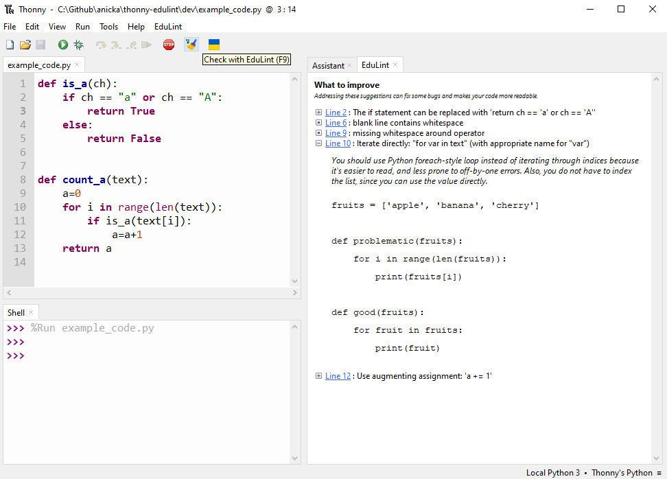

# thonny-edulint

[](https://pypi.org/project/edulint/)


A [Thonny](https://github.com/thonny/thonny) plugin to add most of [EduLint](https://github.com/GiraffeReversed/edulint)'s warnings.

## Installing
To install from pip3 using a terminal (or Powershell for Windows users)
```bash
pip3 install thonny-edulint
# Or
python3 -m pip install thonny-edulint
```

To install directly from Thonny:
1. Click "Tools" and then click "Manage Plug-ins..."
2. Search for "thonny-edulint" in the input box.
3. Click install.

After installing you will need to restart Thonny.

### Known issues

Due to bug in Thonny 4.0.0 to 4.1.1 there are two steps required to install `thonny-edulint`.

1. Thonny -> Tools -> Manage plug-ins... -> thonny-edulint -> Install
2. Thonny -> Tools -> Manage packages... -> edulint -> Install

If you forget the second step, the code linting will fail and give you a message reminding you that it's necessary.

The bug should be fixed in Thonny 4.1.2, after which this workaround shouldn't be necessary. More info is in [this issue](https://github.com/GiraffeReversed/thonny-edulint/issues/2) and the one referred from it.

## Screenshot demo




## License information

The codebase of this plugin started as a copy of [thonny-flake](https://github.com/Bigjango13/thonny-flake) which is licensed under [MIT](https://github.com/Bigjango13/thonny-flake/blob/main/LICENSE).
